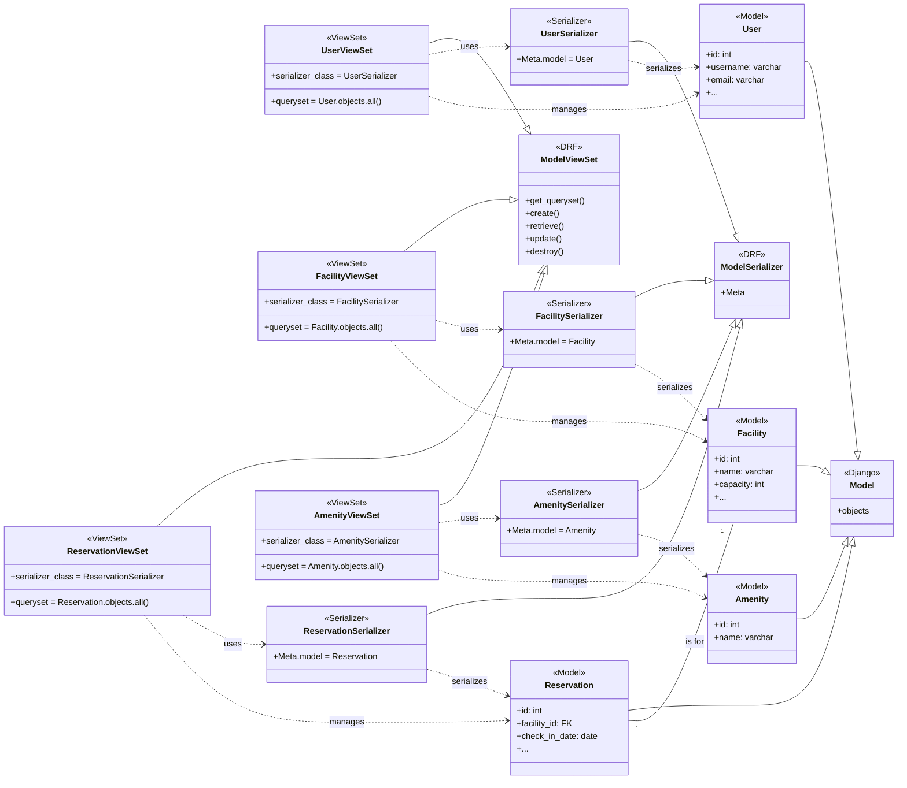

# バックエンドアーキテクチャ (クラス図)

このドキュメントは、Djangoバックエンドの主要なコンポーネント（モデル、シリアライザ、ビューセット）間の静的な関係性を示すクラス図です。

```mermaid
classDiagram
    direction LR

    %% Base Classes
    class ModelViewSet {
        <<DRF>>
        +get_queryset()
        +create()
        +retrieve()
        +update()
        +destroy()
    }
    class Model {
        <<Django>>
        +objects
    }
    class ModelSerializer {
        <<DRF>>
        +Meta
    }

    %% User Resource
    class User {
        <<Model>>
        +id: int
        +username: varchar
        +email: varchar
        +...
    }
    class UserSerializer {
        <<Serializer>>
        +Meta.model = User
    }
    class UserViewSet {
        <<ViewSet>>
        +queryset = User.objects.all()
        +serializer_class = UserSerializer
    }

    %% Facility Resource
    class Facility {
        <<Model>>
        +id: int
        +name: varchar
        +capacity: int
        +...
    }
    class FacilitySerializer {
        <<Serializer>>
        +Meta.model = Facility
    }
    class FacilityViewSet {
        <<ViewSet>>
        +queryset = Facility.objects.all()
        +serializer_class = FacilitySerializer
    }

    %% Reservation Resource
    class Reservation {
        <<Model>>
        +id: int
        +facility_id: FK
        +check_in_date: date
        +...
    }
    class ReservationSerializer {
        <<Serializer>>
        +Meta.model = Reservation
    }
    class ReservationViewSet {
        <<ViewSet>>
        +queryset = Reservation.objects.all()
        +serializer_class = ReservationSerializer
    }

    %% Amenity Resource
    class Amenity {
        <<Model>>
        +id: int
        +name: varchar
    }
    class AmenitySerializer {
        <<Serializer>>
        +Meta.model = Amenity
    }
    class AmenityViewSet {
        <<ViewSet>>
        +queryset = Amenity.objects.all()
        +serializer_class = AmenitySerializer
    }


    %% Relationships
    User --|> Model
    Facility --|> Model
    Reservation --|> Model
    Amenity --|> Model

    UserViewSet --|> ModelViewSet
    FacilityViewSet --|> ModelViewSet
    ReservationViewSet --|> ModelViewSet
    AmenityViewSet --|> ModelViewSet

    UserSerializer --|> ModelSerializer
    FacilitySerializer --|> ModelSerializer
    ReservationSerializer --|> ModelSerializer
    AmenitySerializer --|> ModelSerializer

    UserViewSet ..> UserSerializer : uses
    UserViewSet ..> User : manages
    UserSerializer ..> User : serializes

    FacilityViewSet ..> FacilitySerializer : uses
    FacilityViewSet ..> Facility : manages
    FacilitySerializer ..> Facility : serializes

    ReservationViewSet ..> ReservationSerializer : uses
    ReservationViewSet ..> Reservation : manages
    ReservationSerializer ..> Reservation : serializes

    AmenityViewSet ..> AmenitySerializer : uses
    AmenityViewSet ..> Amenity : manages
    AmenitySerializer ..> Amenity : serializes

    Reservation "1" -- "1" Facility : is for
```
