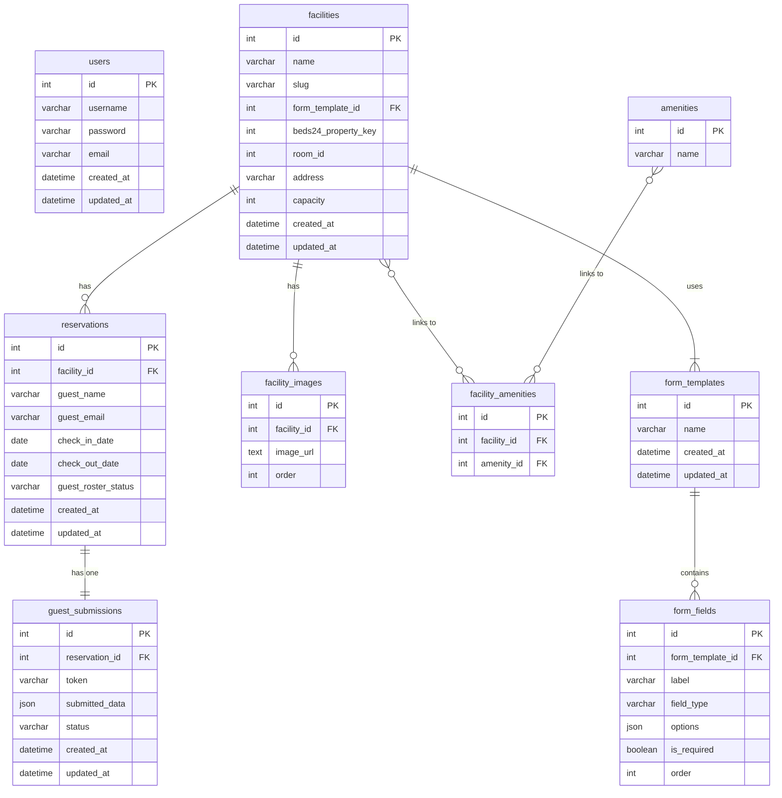

# データベース設計

## テーブル定義
### users
- `id` (PK, int) - 主キー
- `username` (varchar) - ユーザー名
- `password` (varchar) - ハッシュ化して保存
- `email` (varchar, unique) - メールアドレス
- `created_at` (datetime) - 登録日時
- `updated_at` (datetime) - 更新日時

### facilities
- `id` (PK, int) - 主キー
- `name` (varchar) - 施設名
- `slug` (varchar, unique) - URL用の識別子 (例: "villa-sakura")
- `form_template_id` (FK, int) -> `form_templates.id` - この施設が使用するフォームテンプレート
- `beds24_property_key` (int, unique) - Beds24のプロパティキー
- `room_id` (int, unique) - 部屋ID
- `address` (varchar) - 住所
- `capacity` (int) - 最大収容人数
- `num_parking` (int) - 駐車台数
- `google_map_url` (text) - Google MapのURL
- `check_in_time` (time) - チェックイン時刻
- `check_out_time` (time) - チェックアウト時刻
- `description` (text) - 施設説明
- `management_type` (varchar) - 管理形態 (例: "company", "consigned")
- `created_at` (datetime) - 登録日時
- `updated_at` (datetime) - 更新日時

### amenities
- `id` (PK, int) - 主キー
- `name` (varchar, unique) - 設備・アメニティ名

### facility_amenities (中間テーブル)
- `id` (PK, int) - 主キー
- `facility_id` (FK, int) -> `facilities.id`
- `amenity_id` (FK, int) -> `amenities.id`

### facility_images
- `id` (PK, int) - 主キー
- `facility_id` (FK, int) -> `facilities.id`
- `image_url` (text) - 画像のURL
- `order` (int) - 画像の表示順

### reservations
- `id` (PK, int) - 主キー
- `facility_id` (FK, int) -> `facilities.id`
- `guest_name` (varchar) - 宿泊代表者名
- `guest_email` (varchar) - 宿泊代表者メールアドレス
- `check_in_date` (date) - チェックイン日
- `check_out_date` (date) - チェックアウト日
- `num_guests` (int) - 宿泊人数
- `total_price` (decimal) - 合計料金
- `payment_status` (varchar) - 支払い状況 (例: "pending", "paid", "failed")
- `guest_roster_status` (varchar) - 宿泊者名簿の提出状況 (例: "pending", "submitted", "verified")
- `accommodation_tax_status` (varchar) - 宿泊税の支払い状況 (例: "not_applicable", "pending", "paid")
- `created_at` (datetime) - 登録日時
- `updated_at` (datetime) - 更新日時

### 動的フォーム関連モデル
#### form_templates
- `id` (PK, int) - 主キー
- `name` (varchar) - テンプレート名 (例: "A施設用フォーム")
- `created_at` (datetime) - 登録日時
- `updated_at` (datetime) - 更新日時

#### form_fields
- `id` (PK, int) - 主キー
- `form_template_id` (FK, int) -> `form_templates.id`
- `label` (varchar) - 質問文 (例: "お名前")
- `field_type` (varchar) - 入力形式 (例: "text", "email", "date", "file", "radio")
- `options` (json) - 選択肢 (radioなどの場合)
- `is_required` (boolean) - 必須項目か
- `order` (int) - 表示順

#### guest_submissions
- `id` (PK, int) - 主キー
- `reservation_id` (FK, int) -> `reservations.id`
- `token` (varchar, unique) - フォームアクセス用の一時トークン
- `submitted_data` (json) - ゲストが入力したデータ
- `status` (varchar) - 提出状況 (例: "pending", "completed")
- `created_at` (datetime) - 登録日時
- `updated_at` (datetime) - 更新日時

## ER図 (Mermaid)

