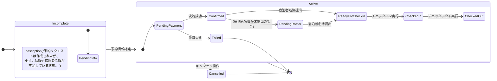

# 予約ステートマシン図

このダイアグラムは、`Reservation`（予約）オブジェクトのライフサイクル、つまり生成から完了またはキャンセルに至るまでの全ての状態と遷移を示します。

### 状態の説明

-   **Incomplete (未完了):**
    -   予約リクエストはシステムに記録されたが、処理を次に進めるための情報が不足している初期状態。
-   **PendingPayment (支払い待ち):**
    -   全ての予約情報が揃い、ユーザーの支払い待ちの状態。Stripeの決済セッションが作成される。
-   **Failed (失敗):**
    -   決済が失敗した、またはタイムアウトした状態。
-   **Confirmed (予約確定):**
    -   決済が成功し、施設の予約が確保された状態。
-   **PendingRoster (名簿提出待ち):**
    -   予約は確定したが、宿泊者名簿がまだ提出されていない状態。
-   **ReadyForCheckIn (チェックイン準備完了):**
    -   名簿も提出され、チェックインを待つだけの状態。
-   **CheckedIn (チェックイン済み):**
    -   宿泊者がチェックインした状態。
-   **CheckedOut (チェックアウト済み):**
    -   宿泊が完了し、精算もすべて終わった最終状態。
-   **Cancelled (キャンセル):**
    -   ユーザーまたは管理者によって予約がキャンセルされた状態。キャンセルポリシーに基づき、返金処理などが行われる場合がある。
