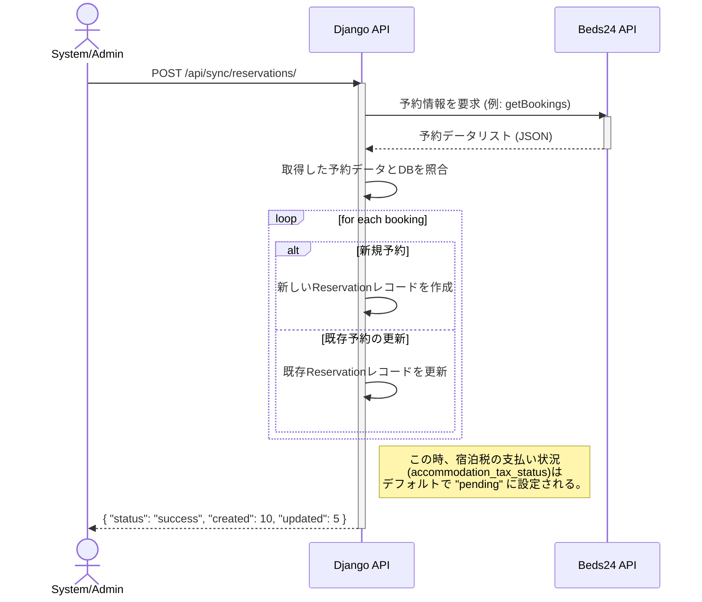
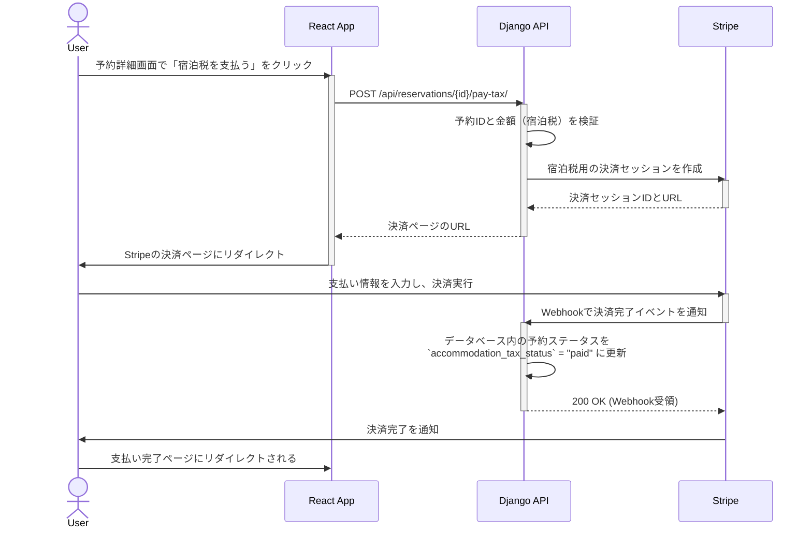
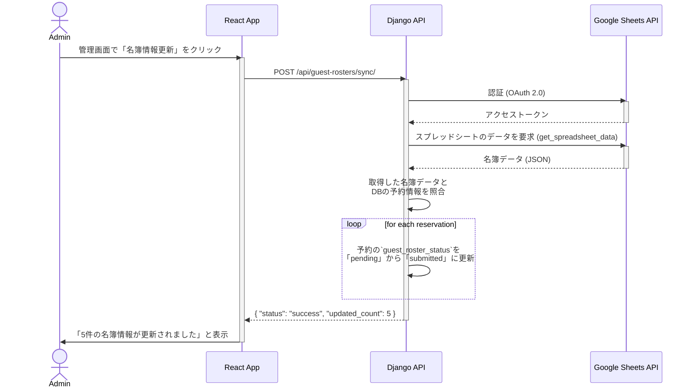

# シーケンス図

このドキュメントは、システムの主要な機能（ユースケース）における、コンポーネント間のインタラクションを時系列で示します。

## 1. 予約情報 同期フロー

Beds24等の外部予約サイトから予約情報を取得し、ローカルのデータベースを更新するシナリオです。管理者が手動で実行、またはシステムが定期的に自動実行することを想定しています。

## 2. 宿泊税 支払いフロー

ユーザーが特定の予約に対する宿泊税を支払うシナリオです。

## 3. 宿泊者名簿の連携フロー

管理者が名簿の提出状況を確認し、Google スプレッドシートから情報を取得するシナリオです。

