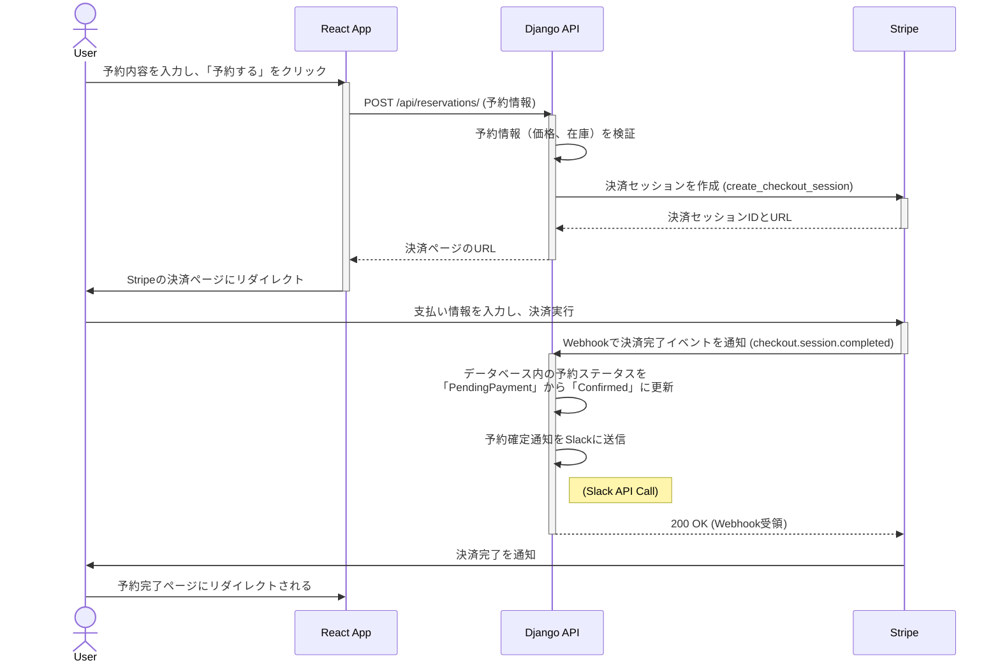
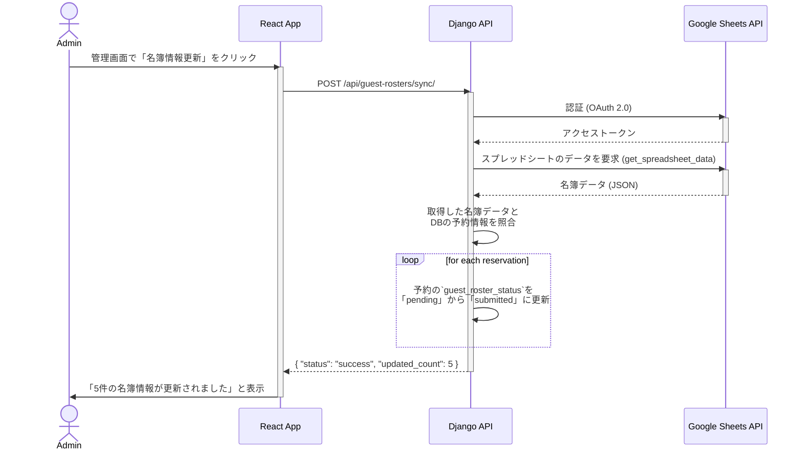

# シーケンス図

このドキュメントは、システムの主要な機能（ユースケース）における、コンポーネント間のインタラクションを時系列で示します。

## 1. 新規予約フロー (成功時)

ユーザーが施設を予約し、Stripeによる決済を成功させるまでのハッピーパス・シナリオです。

## 2. 宿泊者名簿の連携フロー

管理者が名簿の提出状況を確認し、Google スプレッドシートから情報を取得するシナリオです。

