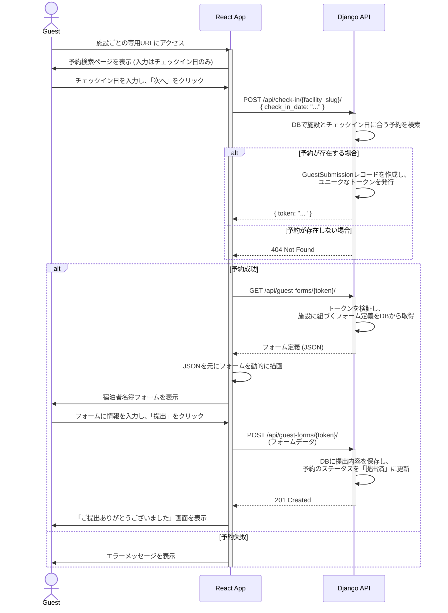
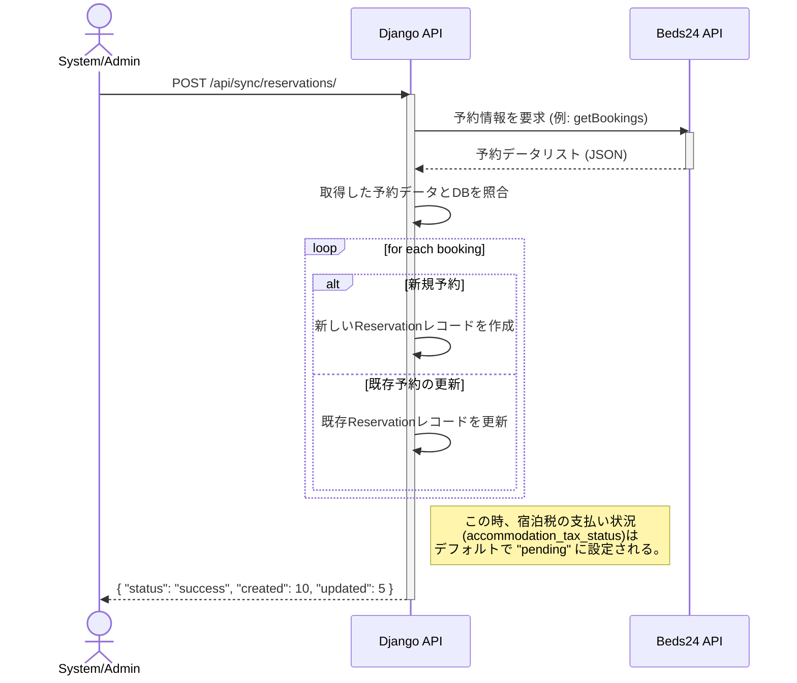
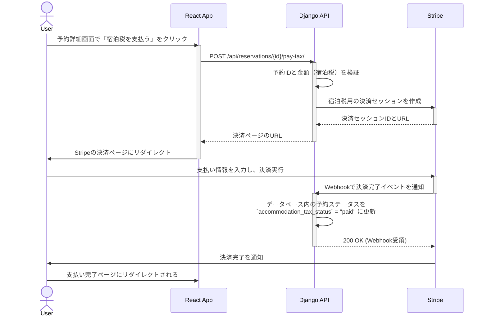

# シーケンス図

このドキュメントは、システムの主要な機能（ユースケース）における、コンポーネント間のインタラクションを時系列で示します。

## 1. 宿泊者名簿 提出フロー (新)

ゲストが施設ごとの専用リンクからアクセスし、宿泊者名簿を提出するシナリオ。

## 2. 予約情報 同期フロー

Beds24等の外部予約サイトから予約情報を取得し、ローカルのデータベースを更新するシナリオです。管理者が手動で実行、またはシステムが定期的に自動実行することを想定しています。

## 3. 宿泊税 支払いフロー

ユーザーが特定の予約に対する宿泊税を支払うシナリオです。

